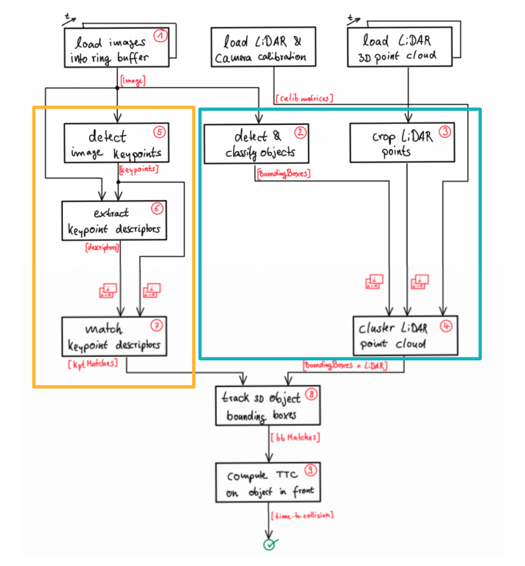
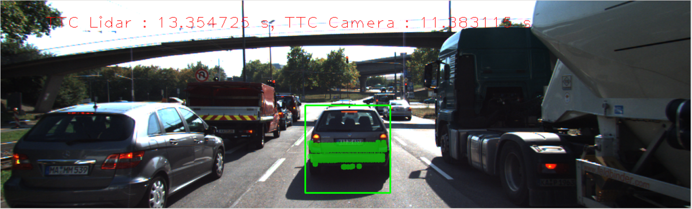
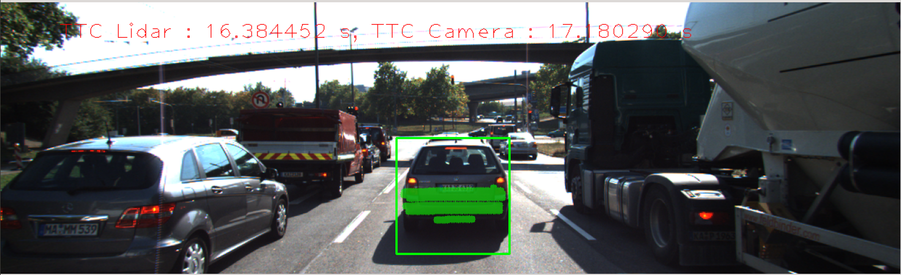
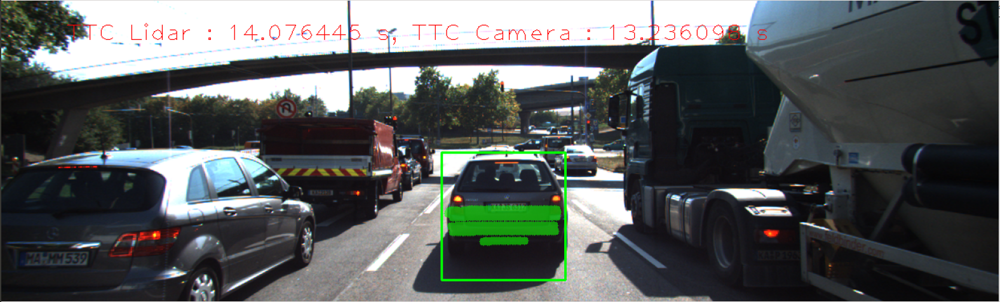
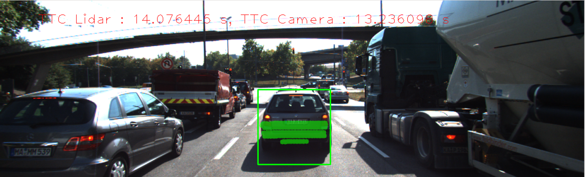

# SFND 3D Object Tracking

<p align="center">

</p>

This project is the third in Udacity's Sensor Fusion Nanodegree. The project covers all parts shown below in the TTC Building blocks.

<p align="center">

</p>

 

## Dependencies for Running Locally
* cmake >= 2.8
  * All OSes: [click here for installation instructions](https://cmake.org/install/)
* make >= 4.1 (Linux, Mac), 3.81 (Windows)
  * Linux: make is installed by default on most Linux distros
  * Mac: [install Xcode command line tools to get make](https://developer.apple.com/xcode/features/)
  * Windows: [Click here for installation instructions](http://gnuwin32.sourceforge.net/packages/make.htm)
* Git LFS
  * Weight files are handled using [LFS](https://git-lfs.github.com/)
* OpenCV >= 4.1
  * This must be compiled from source using the `-D OPENCV_ENABLE_NONFREE=ON` cmake flag for testing the SIFT and SURF detectors.
  * The OpenCV 4.1.0 source code can be found [here](https://github.com/opencv/opencv/tree/4.1.0)
* gcc/g++ >= 5.4
  * Linux: gcc / g++ is installed by default on most Linux distros
  * Mac: same deal as make - [install Xcode command line tools](https://developer.apple.com/xcode/features/)
  * Windows: recommend using [MinGW](http://www.mingw.org/)

## Basic Build Instructions

1. Clone this repo.
2. Make a build directory in the top level project directory: `mkdir build && cd build`
3. Compile: `cmake .. && make`
4. Run it: `./3D_object_tracking`.

## Project Rubric Points

#### 1. FP.1 Match 3D Objects
In this part, we try to match 3D objects in different frames using Features extractions and matching.

in camFusuin_Student.cpp
```c++
void matchBoundingBoxes(std::vector<cv::DMatch> &matches, std::map<int, int> &bbBestMatches, DataFrame &prevFrame, DataFrame &currFrame)
{
    /* 
    Note: matches contain query(prevFrame) keypoint id and train(currFrame) matched keypoint id 
    To get keypoint's (x,y) we access keypoint[keypointId].pt
    */
    int prevKpIdx, currKpIdx;
    cv::KeyPoint prevKp, currKp;
    
    int pSize = prevFrame.boundingBoxes.size();
    int cSize = currFrame.boundingBoxes.size();
    int counts[pSize][cSize] = { };

    vector<int> prevBoxesIds, currBoxesIds;

    // loop over matched keypoints 
    for(auto it1=matches.begin(); it1!= matches.end(); ++it1)
    {
        prevKpIdx = (*it1).queryIdx;
        currKpIdx = (*it1).trainIdx;

        prevKp = prevFrame.keypoints[prevKpIdx];
        currKp = currFrame.keypoints[currKpIdx];

        prevBoxesIds.clear();
        currBoxesIds.clear();

        // prev frame bounding boxes contain this keypoint
        for(auto it2 = prevFrame.boundingBoxes.begin(); it2!= prevFrame.boundingBoxes.end(); ++it2)
        {
            if((*it2).roi.contains(prevKp.pt))
                prevBoxesIds.push_back((*it2).boxID);
        }

        // current frame bounding boxes contain this matched keypoint
        for(auto it2 = currFrame.boundingBoxes.begin(); it2!= currFrame.boundingBoxes.end(); ++it2)
        {
            if((*it2).roi.contains(prevKp.pt))
                currBoxesIds.push_back((*it2).boxID);
        }

        // update counter
        for(auto prevId:prevBoxesIds)
        {
            for(auto currId:currBoxesIds)
                counts[prevId][currId]++;
        }

    }
    // select best matches boxes
    int maxCount=0, maxId;
    for(int prevId=0; prevId<pSize; prevId++)
    {
        maxCount = 0;
        for(int currId=0; currId<cSize; currId++)
        {
            if (counts[prevId][currId] > maxCount)
            {
                maxCount = counts[prevId][currId];
                maxId = currId;
            }
        }
        bbBestMatches[prevId] = maxId;
        
    }
}
```

#### 2. FP.2 Compute Lidar-based TTC
In this part we compute time-to-collision for all matched 3D objects using only Lidar measurements from the matched bounding boxes between current and previous frame.

We do this by computing mean X distance between ego car and preceding vehicles in the current and previous frame, then we use the math equations shown below.
<p align="center">


</p>

**Code**: in camFusuin_Student.cpp
```c++
void computeTTCLidar(std::vector<LidarPoint> &lidarPointsPrev,
                     std::vector<LidarPoint> &lidarPointsCurr, double frameRate, double &TTC)
{
    double prevX=0, currX=0, speed;


    if(!lidarPointsPrev.size() || !lidarPointsCurr.size())
    {
        TTC = NAN;
        return;
    }

    // get avg x for prev frame points, we get avg to avoid work with outlier as min x point 
    for(auto it = lidarPointsPrev.begin(); it!= lidarPointsPrev.end(); ++it)
    {
        prevX += (*it).x;
    }
    prevX/=lidarPointsPrev.size();

    // get avg x for curr frame points
    for(auto it = lidarPointsCurr.begin(); it!= lidarPointsCurr.end(); ++it)
    {
        currX += (*it).x;
    }
    currX/=lidarPointsCurr.size();
    
    // relative speed
    speed = (prevX - currX) / (1/frameRate);
    
    // infront car speed > ego car speed -- > TTC = INF;
    if(speed<0)
    {
        TTC = NAN;
        return;
    }
    TTC = currX/speed;
}
```

#### 3. FP.3 Associate Keypoint Correspondences with Bounding Boxes
In this part we Prepare the TTC computation based on camera measurements by associating keypoint correspondences to the bounding boxes which enclose them.

We do this by using the distance between all keypoints on the vehicle relative to each other to compute a robust estimate of the height ratio in TTC equation. The figures below illustrates this concept.

<p align="center">


</p>
In (a), a set of keypoints has been detected and the relative distances between keypoints 1-7 have been computed. In (b), 4 keypoints have been matched between successive frames (with keypoint 3 being a mismatch). The ratio of all relative distances between each other can be used to compute a reliable TTC estimate by replacing the height ratio h_1 / h_0 with the mean or median of all distance ratios d_k / d_k'.

**code**: in camFusuin_Student.cpp
```c++
void clusterKptMatchesWithROI(BoundingBox &boundingBox, std::vector<cv::KeyPoint> &kptsPrev, std::vector<cv::KeyPoint> &kptsCurr, std::vector<cv::DMatch> &kptMatches)
{
    
    
    cv::KeyPoint tempCurrKp, tempPrevKp;
    vector<cv::DMatch> mtchsBB;
    vector<double>eucliadianDis;

    // find matches for keypoints in BB
    for (auto it = kptMatches.begin(); it!=kptMatches.end(); ++it)
    {
        tempCurrKp = kptsCurr[(*it).trainIdx];
        tempPrevKp = kptsPrev[(*it).queryIdx];

        if(boundingBox.roi.contains(tempCurrKp.pt))
        {
            mtchsBB.push_back((*it));
            eucliadianDis.push_back(cv::norm(tempCurrKp.pt-tempPrevKp.pt));
        }
    }
    
    /* filtering matches to remove outliers */
    
    // compute mean of matches Eucliadian Distance
    double mean = std::accumulate(eucliadianDis.begin(), eucliadianDis.end(), 0.0) / eucliadianDis.size();
    double distTh = 1.5 * mean;

    // associate best matches to given BB
    auto it1= mtchsBB.begin();
    for (auto it2 = eucliadianDis.begin(); it2!=eucliadianDis.end(); ++it2,++it1)
    {
        if((*it2) <  distTh  )
        {
            tempCurrKp = kptsCurr[(*it1).trainIdx];
            boundingBox.kptMatches.push_back((*it1));
            boundingBox.keypoints.push_back(tempCurrKp);
        }
    }
    
}
```

#### 4. FP.4 Compute Camera-based TTC
In this part we Compute the time-to-collision in second for all matched 3D objects using only keypoint correspondences from the matched bounding boxes between current and previous frame.

in camFusuin_Student.cpp
```c++
void computeTTCCamera(std::vector<cv::KeyPoint> &kptsPrev, std::vector<cv::KeyPoint> &kptsCurr, 
                      std::vector<cv::DMatch> kptMatches, double frameRate, double &TTC, cv::Mat *visImg)
{
    
    // compute distance ratios between all matched keypoints
    vector<double> distRatios; // stores the distance ratios for all keypoints between curr. and prev. frame
    for (auto it1 = kptMatches.begin(); it1 != kptMatches.end() - 1; ++it1)
    { 
        // outer kpt. loop
        // get current keypoint and its matched partner in the prev. frame
        cv::KeyPoint kpOuterCurr = kptsCurr.at(it1->trainIdx);
        cv::KeyPoint kpOuterPrev = kptsPrev.at(it1->queryIdx);

        for (auto it2 = kptMatches.begin() + 1; it2 != kptMatches.end(); ++it2)
        { 
            // inner kpt.-loop
            double minDist = 90.0; // min. required distance

            // get next keypoint and its matched partner in the prev. frame
            cv::KeyPoint kpInnerCurr = kptsCurr.at(it2->trainIdx);
            cv::KeyPoint kpInnerPrev = kptsPrev.at(it2->queryIdx);

            // compute distances and distance ratios
            double distCurr = cv::norm(kpOuterCurr.pt - kpInnerCurr.pt);
            double distPrev = cv::norm(kpOuterPrev.pt - kpInnerPrev.pt);

            if (distPrev > std::numeric_limits<double>::epsilon() && distCurr >= minDist)
            { 
                // avoid division by zero
                //cout<<"disCurr: "<<distCurr<<" distPrev = "<<distPrev<<endl;
                double distRatio = distCurr / distPrev;
                distRatios.push_back(distRatio);
            }
        } // eof inner loop over all matched kpts
    }     // eof outer loop over all matched kpts

    // only continue if list of distance ratios is not empty
    if (distRatios.size() == 0)
    {
        TTC = NAN;
        return;
    }

    std::sort(distRatios.begin(), distRatios.end());
    long medIndex = floor(distRatios.size() / 2.0);

    double medDistRatio = distRatios.size() % 2 == 0 ? (distRatios[medIndex - 1] + distRatios[medIndex]) / 2.0 : distRatios[medIndex]; // compute median dist. ratio to remove outlier influence

    double dT = 1 / frameRate;
    TTC = -dT / (1 - medDistRatio);
}
```

#### 5. FP.5 Performance Evaluation 1
TTC from Lidar is not always correct because of some outliers and some unstable points from preceding vehicle's front mirrors, those need to be filtered out.

example of errors in Lidar TTC shown below, where first TTC was ~13 s, and it jumped to ~16 s then decreased to ~14 s

<p align="center">



</p>

#### 6. FP.6 Performance Evaluation 2

From the previous <a href="https://github.com/AhmdNassar/SFND-2D-Feature-Tracking">project</a> top 3 detector/descriptor has been seletected in terms of their performance on accuracy and speed.
<br><br>
Like Lidar, TTC from camera is not always correct as when get a robust clusterKptMatchesWithROI can get a stable TTC from Camera. if the result get unstable, It's probably the worse keypints matches.

example of errors in Camera TTC shown below, where first TTC was ~11 s, and it jumped to ~17 s then decreased to ~13 s

<p align="center">



</p>